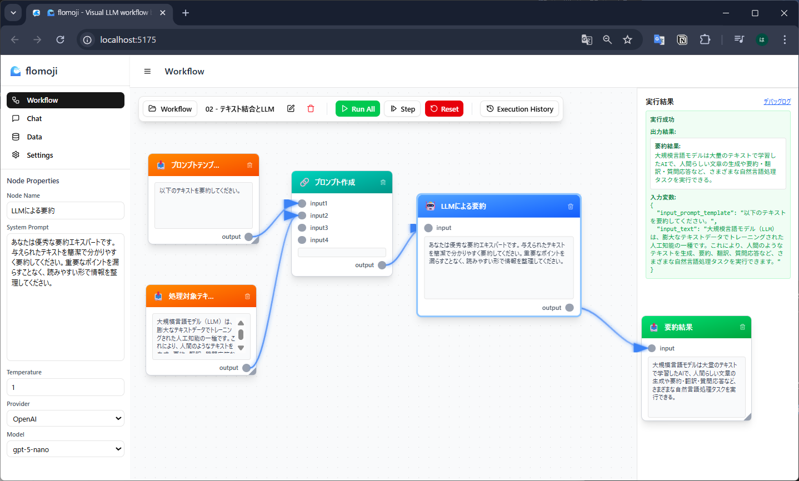

# 🌊 flomoji

**Visual LLM workflow builder for everyone**

flomoji enables AI conversations and workflow automation without complex setup. Supporting various AI providers including OpenAI, Anthropic, and local LLMs, it streamlines your work through prompt chaining and multi-step processing.

**ブラウザだけで動く、軽量LLMエージェント開発ツール**

flomojiは、複雑な環境構築なしにAIとの対話やワークフロー自動化を実現する軽量ツールです。 OpenAI、Anthropic、ローカルLLMなど様々なAIプロバイダーに対応し、プロンプトチェーンによる多段階処理で作業を効率化できます。

## ✨ Features (特徴)

- 🚀 **Browser-only**: No installation required, runs directly in your browser.
- 💬 **AI Chat**: Real-time conversations with AI, with chat history management.
- 🔗 **Workflows**: Automate tasks using prompt chaining.
- 🔌 **Multi-LLM Support**: Works with OpenAI, Anthropic, and local LLMs.
- 📊 **Data Management**: Easily manage and export your data.

## 📸 Screenshots



*Visual workflow builder with node-based interface for creating AI-powered automation workflows.*

## 🚀 Quick Start (利用方法)

### 🌐 Try Online (オンラインで試す)
**Instant access**: [**👉 Launch flomoji**](https://hama-jp.github.io/llm-agent-lite/) - No download required!

### 📥 Download for Offline Use
The easiest way to use flomoji locally is directly in your browser without any setup.

1.  **Download**: [Click here to download the latest version.](https://github.com/hama-jp/llm-agent-lite/archive/refs/heads/gh-pages.zip)
2.  **Unzip**: Extract the downloaded ZIP file.
3.  **Open**: Open the `index.html` file in your web browser (like Chrome, Firefox, or Edge).

That's it! You can start using the application immediately.

## 📝 How to Use (主な機能)

- **Settings (設定)**: Choose your LLM provider (like OpenAI) and enter your API key or endpoint. Test the connection to make sure it's working.
- **Chat (チャット)**: Start a conversation with the AI. Your chat history is saved automatically.
- **Workflow (ワークフロー)**: Define a series of prompts to automate a complex task. Input your data, select a workflow, and run it.
- **Data (データ)**: View, export, or back up your conversation history and other data.

## 🧑‍💻 For Developers (開発者向け)

If you want to run the app locally or contribute to development:

**Run locally:**
```bash
# Install dependencies
pnpm install

# Start the development server
pnpm run dev
```
Then, open `http://localhost:5173` in your browser.

**Build for production:**
```bash
# Create a production build
pnpm run build
```
The output files will be in the `dist` folder. You can deploy this folder to any static hosting service.

## 🔐 Security (セキュリティ)

- Your API keys are stored only in your browser's LocalStorage.
- All data processing happens on the client-side (in your browser).
- No data is ever sent to or stored on a server.

## 📄 License (ライセンス)

This project is licensed under the Apache 2.0 License.

## ❤️ Support (サポート)

If you have any issues or feature requests, please open an issue on GitHub.
