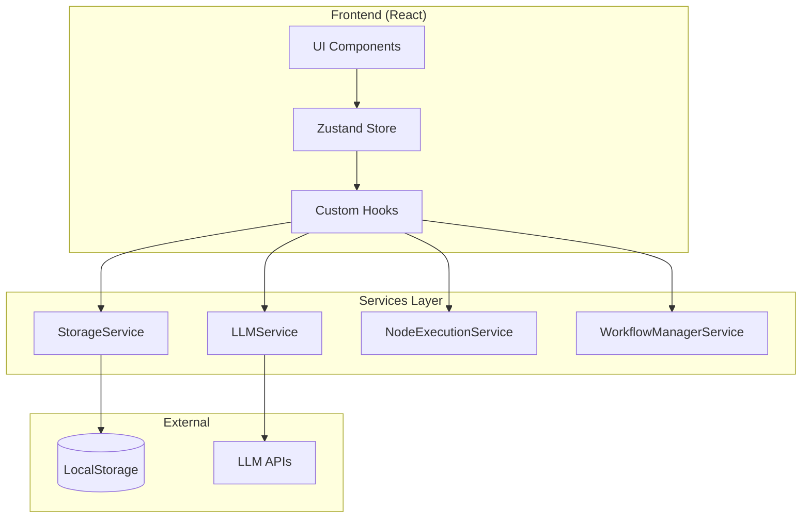

# 🏗️ アーキテクチャ概要

LLM Agent Lite (flomoji) のシステムアーキテクチャとデザイン決定について説明します。

## 📐 システム全体像



## 🎯 設計原則

### 1. ブラウザファースト
- サーバー不要で動作
- ローカルストレージを活用した永続化
- オフライン対応可能な設計

### 2. 拡張性
- プラガブルなノードシステム
- 新しいLLMプロバイダーの追加が容易
- カスタムワークフローの作成が可能

### 3. シンプルさ
- 最小限の依存関係
- 明確な責任分離
- 理解しやすいコードベース

## 🔧 コアコンポーネント

### 状態管理 (Zustand)

```javascript
// store/store.js の構造
{
  // ワークフロー関連
  nodes: [],           // ワークフローノード
  connections: [],     // ノード間の接続
  currentWorkflow: {}, // 現在のワークフロー
  
  // UI状態
  selectedNode: null,  // 選択中のノード
  editingNode: null,   // 編集中のノード
  
  // 実行状態
  executionState: {
    running: false,
    currentNodeId: null,
    executedNodeIds: Set
  },
  
  // アクション
  setNodes: (nodes) => {},
  addNode: (node) => {},
  updateNode: (id, data) => {},
  deleteNode: (id) => {},
  // ...
}
```

### サービスレイヤー

#### StorageService
ローカルストレージの抽象化層として機能します。

```javascript
class StorageService {
  static keys = {
    SETTINGS: 'llm-agent-settings',
    WORKFLOWS: 'llm-agent-workflows',
    CHAT_HISTORY: 'llm-agent-chat-history'
  }
  
  static get(key, defaultValue = null)
  static set(key, value)
  static clear(key)
  static getWorkflowById(id)
  static saveWorkflow(workflow)
}
```

**設計決定**:
- 静的メソッドによるシンプルなAPI
- キー管理の一元化
- 型安全性の考慮

#### LLMService
各種LLMプロバイダーとの通信を統一的に扱います。

```javascript
class LLMService {
  static async sendMessage(message, options = {}) {
    // プロバイダーに応じた処理
    switch (provider) {
      case 'openai':
        return this.sendOpenAIMessage(...)
      case 'anthropic':
        return this.sendAnthropicMessage(...)
      case 'local':
        return this.sendLocalMessage(...)
    }
  }
  
  static async streamMessage(message, onChunk, options = {})
}
```

**特徴**:
- ストリーミング対応
- エラーハンドリング統一
- レート制限の考慮

#### NodeExecutionService
ワークフローの実行エンジンです。

```javascript
class NodeExecutionService {
  static async startExecution(nodes, connections, inputs, nodeTypes) {
    // 1. トポロジカルソート
    const sortedNodes = this.topologicalSort(nodes, connections)
    
    // 2. 実行ジェネレータの作成
    return this.createExecutor(sortedNodes, connections, inputs)
  }
  
  static *createExecutor(sortedNodes, connections, inputs) {
    // ステップ実行をサポート
    for (const node of sortedNodes) {
      yield { currentNodeId: node.id }
      const result = await this.executeNode(node, inputs)
      // ...
    }
  }
}
```

**重要な機能**:
- 非同期ジェネレータによるステップ実行
- 条件分岐とループのサポート
- 変数管理システム

## 🔄 データフロー

### ワークフロー実行のライフサイクル

1. **準備フェーズ**
   ```
   ユーザー入力 → ノード検証 → トポロジカルソート
   ```

2. **実行フェーズ**
   ```
   for each ノード:
     入力収集 → ノード実行 → 結果保存 → 次のノードへ
   ```

3. **完了フェーズ**
   ```
   結果集約 → UI更新 → 履歴保存
   ```

### ノード間のデータ受け渡し

```javascript
// 実行コンテキストの構造
executionContext = {
  [nodeId]: nodeOutput,  // 各ノードの出力
  variables: {           // グローバル変数
    [varName]: value
  }
}
```

## 🎨 UIアーキテクチャ

### コンポーネント階層

```
App
├── Layout
│   ├── Header
│   ├── Sidebar
│   │   ├── NavigationItems
│   │   └── WorkflowList
│   └── MainContent
│       ├── ChatView
│       ├── WorkflowView
│       │   └── NodeEditor
│       ├── SettingsView
│       └── DataView
```

### ノードシステム

各ノードは以下の構造を持ちます：

```javascript
{
  id: 'unique-id',
  type: 'llm|input|output|if|while|...',
  position: { x: 100, y: 200 },
  size: { width: 200, height: 150 },
  data: {
    // ノードタイプ固有のデータ
    label: 'ノード名',
    value: '...',
    // ...
  }
}
```

### 接続システム

```javascript
{
  id: 'connection-id',
  source: 'node-id-1',
  target: 'node-id-2',
  sourcePort: 'output',
  targetPort: 'input'
}
```

## 🔌 拡張ポイント

### 新しいノードタイプの追加

1. `src/components/nodes/` に新しいファイルを作成
2. `createNodeDefinition` を使用してノードを定義
3. `index.js` にエクスポートを追加

### 新しいLLMプロバイダーの追加

1. `llmService.js` に新しいケースを追加
2. APIエンドポイントとヘッダーを設定
3. レスポンスの正規化処理を実装

### カスタムストレージバックエンド

`StorageService` を拡張して、IndexedDBやサーバーストレージをサポート可能。

## 🔒 セキュリティ考慮事項

### APIキーの管理
- ローカルストレージに暗号化せずに保存（ブラウザ環境の制限）
- ユーザーの責任で管理
- 環境変数はサポートしない（ブラウザオンリーのため）

### データの保護
- すべてのデータはローカルに保存
- 外部サーバーへの自動送信なし
- エクスポート/インポート機能でユーザーが管理

## 🚀 パフォーマンス最適化

### レンダリング最適化
- React.memoによるコンポーネントのメモ化
- useCallbackによる関数の再生成防止
- 仮想スクロールの検討（大規模ワークフロー用）

### データ処理
- ワークフローの遅延評価
- ストリーミングレスポンスの活用
- 大規模データの分割処理

## 🔮 今後の拡張計画

### 短期目標
- [ ] ワークフローのバージョン管理
- [ ] ノードのカスタムUIサポート
- [ ] プラグインシステムの導入

### 中期目標
- [ ] WebWorkerを使用したバックグラウンド実行
- [ ] IndexedDBによる大容量データ対応
- [ ] コラボレーション機能（WebRTC）

### 長期目標
- [ ] デスクトップアプリ版（Electron）
- [ ] サーバーサイド実行オプション
- [ ] AIによる自動ワークフロー生成

## 📚 技術スタック詳細

### フロントエンド
- **React 19**: UIフレームワーク
- **Zustand 5**: 状態管理
- **Tailwind CSS 4**: スタイリング
- **shadcn/ui**: UIコンポーネント
- **Vite 6**: ビルドツール

### 開発ツール
- **Vitest**: テストフレームワーク
- **ESLint**: コード品質管理
- **pnpm**: パッケージマネージャー

## 🔍 トラブルシューティング

### よくある問題と解決策

1. **ワークフローが実行されない**
   - ノードの接続を確認
   - コンソールログでエラーを確認
   - デバッグモードを有効化

2. **LLMへの接続エラー**
   - APIキーの確認
   - ネットワーク接続の確認
   - CORSエラーの対処

3. **データが保存されない**
   - ローカルストレージの容量確認
   - ブラウザの設定確認
   - プライベートモードではないことを確認

---

詳細な実装については、各サービスクラスのソースコードとコメントを参照してください。