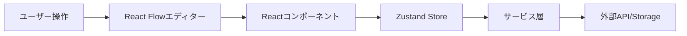

# 🚀 開発者向けクイックスタートガイド

5分でLLM Agent Liteの開発環境を構築し、最初の貢献を始めましょう！

## 📦 前提条件

以下がインストールされていることを確認してください：

```bash
# Node.jsのバージョン確認（20.x以上）
node --version

# pnpmのインストール（未インストールの場合）
npm install -g pnpm

# pnpmのバージョン確認（10.x以上）
pnpm --version
```

## 🎯 30秒でセットアップ

```bash
# 1. リポジトリをクローン
git clone https://github.com/hama-jp/flomoji.git
cd flomoji

# 2. 依存関係をインストール
pnpm install

# 3. 開発サーバーを起動
pnpm run dev
```

ブラウザで http://localhost:5173 を開くと、アプリケーションが起動します！

## 🧭 プロジェクト構造の理解

```
flomoji/
├── src/
│   ├── components/     # UIコンポーネント (React Flow対応)
│   ├── services/       # ビジネスロジック
│   ├── store/          # 状態管理 (Zustand)
│   └── hooks/          # カスタムフック
├── docs/               # ドキュメント
└── tests/              # テスト
```

## 💡 最初の変更を加える

### 例：シンプルな機能追加

**技術スタック情報**:
- React Flow v12 (`@xyflow/react`) を使用したワークフローエディター
- Zustand でノードとエッジの状態管理
- カスタムノードとエッジコンポーネント

1. **新しいユーティリティ関数を追加**

```javascript
// src/utils/textUtils.js を作成
export function reverseText(text) {
  return text.split('').reverse().join('')
}
```

2. **テストを書く**

```javascript
// src/utils/textUtils.test.js を作成
import { describe, it, expect } from 'vitest'
import { reverseText } from './textUtils'

describe('reverseText', () => {
  it('should reverse text', () => {
    expect(reverseText('hello')).toBe('olleh')
  })
})
```

3. **テストを実行**

```bash
pnpm test
```

## 🔨 よく使うコマンド

```bash
# 開発サーバー起動
pnpm run dev

# テスト実行
pnpm test

# テスト（ウォッチモード）
pnpm test:watch

# ビルド
pnpm run build

# Lintチェック
pnpm run lint

# プレビュー（ビルド後）
pnpm run preview
```

## 🎨 最初のノードを作成

最もシンプルなノードの例 (React Flow対応)：

```javascript
// src/components/nodes/HelloWorldNode.js
import { createNodeDefinition } from './types.js'

async function executeHelloWorld(node, inputs) {
  return `Hello, ${inputs.input || 'World'}!`
}

export const HelloWorldNode = createNodeDefinition(
  'Hello World',
  '👋',
  'green',
  ['input'],
  ['output'],
  {},
  executeHelloWorld,
  { description: '挨拶を返します' }
)

export default HelloWorldNode

// ノードをindex.jsに追加した後、React Flowエディターで使用可能になります
```

## 🐛 デバッグのヒント

### ブラウザのDevTools

1. **Console**: `console.log` でデバッグ
2. **Network**: API呼び出しの確認
3. **React DevTools**: コンポーネントの状態確認

### VS Codeのデバッグ

`.vscode/launch.json` を作成：

```json
{
  "version": "0.2.0",
  "configurations": [
    {
      "type": "chrome",
      "request": "launch",
      "name": "Launch Chrome",
      "url": "http://localhost:5173",
      "webRoot": "${workspaceFolder}"
    }
  ]
}
```

## 🔍 コードを探索する

### 重要なファイル

1. **エントリーポイント**: `src/main.jsx`
2. **メインレイアウト**: `src/components/Layout.jsx`
3. **ワークフローエディター**: `src/components/WorkflowView.jsx` (React Flow)
4. **ノード実行エンジン**: `src/services/nodeExecutionService.js`
5. **状態管理**: `src/store/` (Zustand store)

### コードの流れを理解する



## 📝 変更をコミット

```bash
# 新しいブランチを作成
git checkout -b feature/my-awesome-feature

# 変更をステージング
git add .

# コミット
git commit -m "feat: Add awesome feature"

# プッシュ
git push origin feature/my-awesome-feature
```

## 🚢 プルリクエストを作成

1. GitHubでフォークしたリポジトリを開く
2. "Compare & pull request" をクリック
3. 変更内容を説明
4. PRを作成

### PRテンプレート

```markdown
## 変更内容
- 機能Xを追加
- バグYを修正

## テスト方法
1. 開発サーバーを起動
2. 機能Xを使用
3. 結果を確認

## チェックリスト
- [ ] テストを追加した
- [ ] ドキュメントを更新した
```

## 🆘 困ったときは

### よくあるエラーと解決方法

**1. pnpm install が失敗する**
```bash
# キャッシュをクリア
pnpm store prune
pnpm install
```

**2. ポート5173が使用中**
```bash
# 別のポートで起動
pnpm run dev -- --port 3000
```

**3. ESLintエラー**
```bash
# 自動修正を試す
pnpm run lint --fix
```

## 📚 次のステップ

1. **[CONTRIBUTING.md](../CONTRIBUTING.md)** - 詳細な貢献ガイド
2. **[ARCHITECTURE.md](ARCHITECTURE.md)** - システム設計の理解
3. **[NODE_DEVELOPMENT.md](NODE_DEVELOPMENT.md)** - カスタムノードの作成

## 💬 コミュニティ

- **Issues**: バグ報告や機能リクエスト
- **Discussions**: 質問や議論
- **Pull Requests**: コードの貢献

## 🎉 最初の貢献者になろう！

小さな改善でも大歓迎です：
- タイポの修正
- ドキュメントの改善
- テストの追加
- 新機能の提案

---

**Happy Coding! 🚀**

質問があれば、遠慮なくIssueを作成してください。